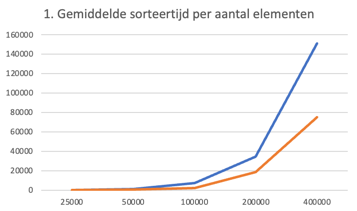
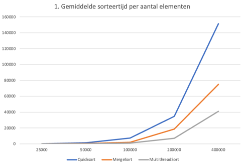

# Rapport: Excercise 1 Concurrency Threads

## Inleiding
Het doel van deze 5 opdrachten is dat je de basics leert van het programmeren met threads in Java.
Omdat elke Thread zijn eigen data beheert en andere threads daar geen toegang toe hoeven te
hebben, is het niet nodig om na te denken over het beschermen van data (kritieke secties).

## Excercise 1.1
Zoals wikipedia ook zegt over Bubble Sort (https://en.wikipedia.org/wiki/Bubble_sort) is het een zeer inefficiënte manier van sorteren voor grotere datasets. Die tijd die nodig is om een array te sorteren wordt exponentieel groter naarmate de array toeneemt. 
Dit komt overeen met de tijdscomplexiteit van O(n2). In de grafiek zien we dat naarmate de Array groter wordt, de tijd ook toeneemt. Dit komt doordat bubblesort door de gehele array loopt totdat er geen mogelijke swaps meer zijn.

## Excercise 1.2
In excercise 1.2 is er ook gebruik gemaakt van Bubble Sorting, maar deze keer is eerst de array met nummers gesplits, gesorteerd en daarna weer gemerged. 
Omdat we weten dat de tijdscomplexiteit O(n2) is, is het een zekere verbetering, want de array is minder groot. Elke helft heeft nog steeds O(n2) tijd nodig, maar 2 kleinere arrays hoeven nu minder te vergelijken en minder te swappen.
In de grafiek zie je ook dat hierdoor de tijd die nodig is om te sorteren 2 keer zo snel is. 
Het samenvoegen is een lineaire operatie O(n). Dit kost veel minder tijd dan sorteren zonder te splitten.

Hier is de blauwe lijn Bubble Sorting ZONDER spliten en de oranje lijn is MET splitsen

## Excercise 1.3
Multithreading heeft ervoor gezorgd dat het 2 keer zo snel verliep als de Bubble Sorting met splitsing van de array. Dit is logisch, want de gesplitste arrays worden tegelijk gesort d.m.v. multithreading.
Dit zie je ook terug in de grafiek.

## Excercise 1.4
